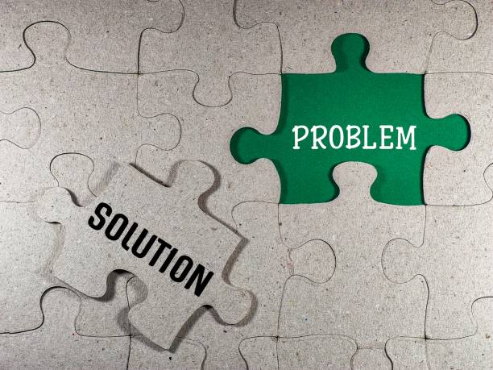

# 🚀 ATMP - Automated Task Management Platform

[](https://opensource.org/licenses/MIT)
[](https://www.python.org/downloads/release/python-3120/)
[](https://docs.djangoproject.com/en/5.2/)
[](https://www.docker.com/)
[](https://github.com/psf/black)

ATMP (Automated Task Management Platform) is a robust and secure Django-based web application designed to streamline task and incident management within an organization. It provides secure two-factor authentication, intuitive role-based access control, and a user-friendly interface for efficient tracking, assignment, and monitoring of tasks and incidents.



---

## 🎯 Table of Contents

* [🌟 Features](#-features)
* [🚀 Getting Started](#-getting-started)
    * [Prerequisites](#prerequisites)
    * [Installation](#installation)
    * [Configuration](#configuration)
    * [Running the Application](#running-the-application)
* [💻 Usage](#-usage)
* [📂 Project Structure](#-project-structure)
* [🧪 Running Tests](#-running-tests)
* [🤝 Contributing](#-contributing)
* [📜 License](#-license)
* [📞 Contact](#-contact)
* [🙏 Acknowledgements](#-acknowledgements)

---

## 🌟 Features

ATMP offers a comprehensive set of features to enhance your team's productivity and security:

* **Secure Two-Factor Authentication (2FA):** Implemented using `django-two-factor-auth` to provide an additional layer of security for all user logins.
* **Role-Based Access Control (RBAC):** Define and manage user roles (e.g., Admin, Agent, User) with distinct permissions and access levels.
* **Incident Tracking & Management:** Create, categorize, assign, update, and resolve incidents with a clear workflow.
* **Centralized Dashboard Overview:** A responsive dashboard provides real-time insights into active incidents, assigned tasks, and overall system status.
* **User Management:** Admin users can efficiently create, update, and deactivate user accounts, along with managing their associated roles.
* **Password Reset Functionality:** Secure and standard Django password reset flow is implemented.
* **Responsive Design:** Built with a modern frontend theme (SB Admin 2) ensuring optimal viewing and interaction across various devices.
* **reCAPTCHA Integration:** Protects public-facing forms (like login and registration) against automated bot attacks using Google's reCAPTCHA v2.

---

## 🚀 Getting Started

Follow these instructions to set up and run the ATMP application on your local machine for development or via Docker for a production-like environment.

### Prerequisites

Ensure you have the following software installed on your system:

* **Python:** Version 3.12 or newer.
* **pip:** Python package installer (comes with Python).
* **Git:** Version control system.
* **Docker & Docker Compose:** (Required for production setup or Dockerized development).

### Installation

1.  **Clone the repository:**
    ```bash
    git clone [https://github.com/isaacaisha/atmp.git](https://github.com/isaacaisha/atmp.git)
    cd atmp_app
    ```

2.  **Set up a Python Virtual Environment (Recommended for Development):**
    ```bash
    python -m venv venv
    source venv/bin/activate  # On Windows: venv\Scripts\activate
    ```

3.  **Install Python Dependencies:**
    ```bash
    pip install -r requirements.txt
    ```

### Configuration

Environment variables are used to manage sensitive data and settings.

1.  **Create `.env` file:** Copy the `.env.example` file to `.env` in your project root (`~/atmp`):
    ```bash
    cp .env.example .env
    ```

2.  **Edit `.env` file:** Open the newly created `.env` file and fill in your specific values.

    ```dotenv
    # Required Django Secret Key (generate a strong, random one)
    SECRET_KEY=your_super_secret_key_here_for_security

    # Set to False for production environments for security
    DEBUG=True 

    # Allowed hosts for your Django application (e.g., localhost, your_domain.com, your_server_ip)
    ALLOWED_HOSTS=localhost,127.0.0.1

    # Database Settings (PostgreSQL is recommended and used in Docker)
    DB_NAME=atmp_db
    DB_USER=atmp_user
    DB_PASSWORD=atmp_password
    DB_HOST=localhost # 'db' if using docker-compose for development, 'localhost' for local dev without docker db
    DB_PORT=5432

    # Google reCAPTCHA Keys (Obtain from [https://www.google.com/recaptcha/admin/](https://www.google.com/recaptcha/admin/))
    RECAPTCHA_PUBLIC_KEY=your_recaptcha_site_key_goes_here
    RECAPTCHA_PRIVATE_KEY=your_recaptcha_secret_key_goes_here

    # Email Settings (for password reset, 2FA setup, etc.)
    EMAIL_BACKEND=django.core.mail.backends.smtp.EmailBackend
    EMAIL_HOST=smtp.your-email-provider.com
    EMAIL_PORT=587
    EMAIL_USE_TLS=True
    EMAIL_HOST_USER=your_email@example.com
    EMAIL_HOST_PASSWORD=your_email_password
    DEFAULT_FROM_EMAIL=your_email@example.com
    ```
    **Security Note:** Never commit your actual `.env` file to version control. It contains sensitive credentials.

3.  **Run Database Migrations:**
    ```bash
    python manage.py migrate
    ```

4.  **Create a Superuser (Admin Account):**
    ```bash
    python manage.py createsuperuser
    ```
    Follow the prompts to create your administrative user account.

### Running the Application

#### Development (using Django's built-in server)

To quickly get the application running for development:

```bash
python manage.py runserver 0.0.0.0:8079
```


# [Start Bootstrap - SB Admin 2](https://startbootstrap.com/theme/sb-admin-2/)

[SB Admin 2](https://startbootstrap.com/theme/sb-admin-2/) is an open source admin dashboard theme for [Bootstrap](https://getbootstrap.com/) created by [Start Bootstrap](https://startbootstrap.com/).

For the legacy Bootstrap 3 version of this theme, you can view the [last stable release](https://github.com/StartBootstrap/startbootstrap-sb-admin-2/releases/tag/v3.3.7%2B1) of SB Admin 2 for Bootstrap 3.

## Preview

[](https://startbootstrap.github.io/startbootstrap-sb-admin-2/)

**[Launch Live Preview](https://startbootstrap.github.io/startbootstrap-sb-admin-2/)**

## Status

[](https://raw.githubusercontent.com/StartBootstrap/startbootstrap-sb-admin-2/master/LICENSE)
[](https://www.npmjs.com/package/startbootstrap-sb-admin-2)
[](https://travis-ci.org/StartBootstrap/startbootstrap-sb-admin-2)
[](https://david-dm.org/StartBootstrap/startbootstrap-sb-admin-2)
[](https://david-dm.org/StartBootstrap/startbootstrap-sb-admin-2?type=dev)

## Download and Installation

To begin using this template, choose one of the following options to get started:

* [Download the latest release on Start Bootstrap](https://startbootstrap.com/theme/sb-admin-2/)
* Install via npm: `npm i startbootstrap-sb-admin-2`
* Clone the repo: `git clone https://github.com/StartBootstrap/startbootstrap-sb-admin-2.git`
* [Fork, Clone, or Download on GitHub](https://github.com/StartBootstrap/startbootstrap-sb-admin-2)

## Usage

After installation, run `npm install` and then run `npm start` which will open up a preview of the template in your default browser, watch for changes to core template files, and live reload the browser when changes are saved. You can view the `gulpfile.js` to see which tasks are included with the dev environment.

### Gulp Tasks

* `gulp` the default task that builds everything
* `gulp watch` browserSync opens the project in your default browser and live reloads when changes are made
* `gulp css` compiles SCSS files into CSS and minifies the compiled CSS
* `gulp js` minifies the themes JS file
* `gulp vendor` copies dependencies from node_modules to the vendor directory

You must have npm installed globally in order to use this build environment. This theme was built using node v11.6.0 and the Gulp CLI v2.0.1. If Gulp is not running properly after running `npm install`, you may need to update node and/or the Gulp CLI locally.

## Bugs and Issues

Have a bug or an issue with this template? [Open a new issue](https://github.com/StartBootstrap/startbootstrap-sb-admin-2/issues) here on GitHub or leave a comment on the [template overview page at Start Bootstrap](https://startbootstrap.com/theme/sb-admin-2/).

## About

Start Bootstrap is an open source library of free Bootstrap templates and themes. All of the free templates and themes on Start Bootstrap are released under the MIT license, which means you can use them for any purpose, even for commercial projects.

* <https://startbootstrap.com>
* <https://twitter.com/SBootstrap>

Start Bootstrap was created by and is maintained by **[David Miller](https://davidmiller.io/)**.

* <https://davidmiller.io>
* <https://twitter.com/davidmillerhere>
* <https://github.com/davidtmiller>

Start Bootstrap is based on the [Bootstrap](https://getbootstrap.com/) framework created by [Mark Otto](https://twitter.com/mdo) and [Jacob Thorton](https://twitter.com/fat).

## Copyright and License

Copyright 2013-2021 Start Bootstrap LLC. Code released under the [MIT](https://github.com/StartBootstrap/startbootstrap-resume/blob/master/LICENSE) license.
